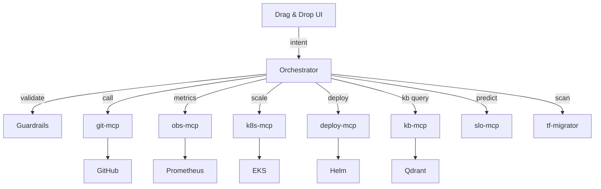

# ZeusAI: The DevOps CoPilot

## Overview
**ZeusAI** is the ultimate DevOps Copilot – an all-in-one, AI-powered, no-code platform that radically simplifies the entire DevOps lifecycle. Designed for DevOps engineers, platform teams, and developers alike, ZeusAI automates, visualizes, and orchestrates everything from infrastructure provisioning to deployment, monitoring, alerting, cost optimization, and audit.

> One dashboard. Zero YAML. Full control.

## Key Concepts

- **AI + Agents + MCP**: ZeusAI is built on the Model Context Protocol (MCP) architecture, combining modular AI tools and microservices with typed APIs, enforced policies, and human approvals.
- **No-Code Drag & Drop Infra Designer**: Build infrastructure and services visually. ZeusAI auto-generates Terraform code, applies it, opens a PR, and waits for approval – all through one interface.
- **GitOps-native**: All changes are tracked via Git. ZeusAI opens PRs, triggers CI/CD, and proceeds only after approval.
- **Unified Dashboard**: Like **DataDog + Kiali + GitHub + Terraform Cloud**, all fused into a visual interface.
- **Import Terraform State**: ZeusAI parses and visualizes existing environments from Terraform state files.
- **AWS Connectivity**: Upon deployment, ZeusAI auto-connects to AWS accounts using configured credentials, IAM roles, or STS.

---

## Core Features

### 🧠 AI-Powered Orchestrator (FastAPI)
- Intent routing: maps commands or UI actions to MCP microservices.
- Guardrail enforcement before execution.
- Signal aggregation from metrics, logs, and external APIs.
- Predictive analytics and decision making.
- Auditable history of every change or denial.

### 🧩 MCP Microservices (Model Context Protocol)
Each tool is a containerized FastAPI service:
- `obs-mcp`: Prometheus metrics aggregation & anomaly detection.
- `k8s-mcp`: Kubernetes interaction (scale, rollout, describe).
- `git-mcp`: PR generation (Terraform diffs, approvals).
- `cloud-mcp`: AWS CE, usage metrics, IAM scanning.
- `kb-mcp`: Vector-based RAG knowledgebase.
- `deploy-mcp`: Helm/Argo CD deployments.
- `slo-mcp`: Enforce SLO thresholds for actions.
- `tf-migrator`: Imports code or existing infra and converts to Terraform.

### 🖱️ Visual Terraform Builder
- Drag in EC2, VPC, Lambda, EKS, Subnets, etc.
- Connect resources (e.g., S3 → Lambda trigger).
- ZeusAI generates Terraform dynamically.
- PR generated in GitHub, displayed in dashboard.
- Terraform plan & apply triggered post-approval.

### 🔁 GitOps & CI/CD Automation
- Follows best practices pipeline:
  - Terraform fmt, validate, plan
  - Security scanning (tfsec, checkov)
  - Unit tests (if applicable)
  - Deployment via ArgoCD/Helm
- CI/CD is generic and modular.

### 📊 Observability, Alerting & Logging
- Metrics via Prometheus + Grafana (embedded).
- Logs via FluentBit → Loki.
- AI for anomaly detection and burst prediction.
- Alert routing (Telegram, Slack, MS Teams) via flags.
- Dashboards per service and infra unit.

### 🔐 Guardrails & Policy Engine
- YAML-defined:
  - Change windows
  - RBAC labels
  - Max scaling thresholds
  - Prod lockdown (e.g., require 2 approvals)
- Realtime enforcement with clear reasons for blocking.
- User override tracked and alerted.

### 🧠 Predictive Infra Intelligence
- AI predicts burst usage based on historical Prometheus data.
- If a user tries to scale down memory or CPU in a cooldown window, system blocks with justification.
- All override attempts are audited and escalated.

### 🗃️ Knowledge Base (RAG)
- Upload `.md`, `.txt`, `.pdf` docs.
- Ask questions in chat or UI.
- Sources returned from vector DB.

### 🧾 Full Audit Trail
- Every action, denied attempt, or override is logged.
- Optional Postgres for long-term audit.

### 🧳 Multi-Mode Operation
| Mode        | Flag       | Stack      | Infra Target     |
|-------------|------------|------------|------------------|
| Local Dev   | `dev`      | Minikube   | Local             |
| Staging     | `testing`  | EKS        | AWS Staging       |
| Production  | `prod`     | EKS        | AWS Production    |

### 🛠 Terraform State Importer
- Parse existing `.tfstate` files.
- Visualize the current infrastructure.
- Resume management from state.

### 📤 Terraform Exporter & Migrator
- Scan any cloud account.
- Export resource configurations into Terraform modules.
- Plan: migrate manually created infra to full GitOps.

---

## Technologies
- **React + Tailwind** (dashboard)
- **FastAPI** (orchestrator + MCP)
- **Terraform** (infra source of truth)
- **Grafana / Prometheus / Loki / Fluentbit** (observability)
- **Qdrant + OpenAI** (RAG KB)
- **LangGraph (optional)** (multi-step planning)
- **Docker Compose / K8s** (runtime)

---

## Deployment

### Prerequisites
- macOS/Linux with Docker
- Python 3.10+
- AWS creds
- GitHub token
- Telegram bot (optional)

### Steps
1. `git clone https://github.com/your-org/zeusai`
2. `cd zeusai && cp .env.example .env`
3. Fill in credentials
4. `docker-compose up --build`
5. Access dashboard on `http://localhost:3000`
6. Connect to Telegram or Slack for ChatOps

---

## Philosophy
ZeusAI isn’t just a DevOps tool. It’s DevOps **liberation**. One pane. Zero YAML. Everything automated and visual, with AI and policies protecting your infrastructure from human error.

- GitOps native.
- Infra-as-Code first.
- Secure by default.
- Built for scale and self-healing.
- Designed to onboard junior engineers without risk.

---

## Architecture Diagram

---

## License
MIT

---

## Made with ❤️ by someone who’s been in war rooms long enough to know the real problem… is repeating yourself.
